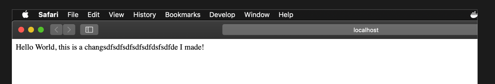
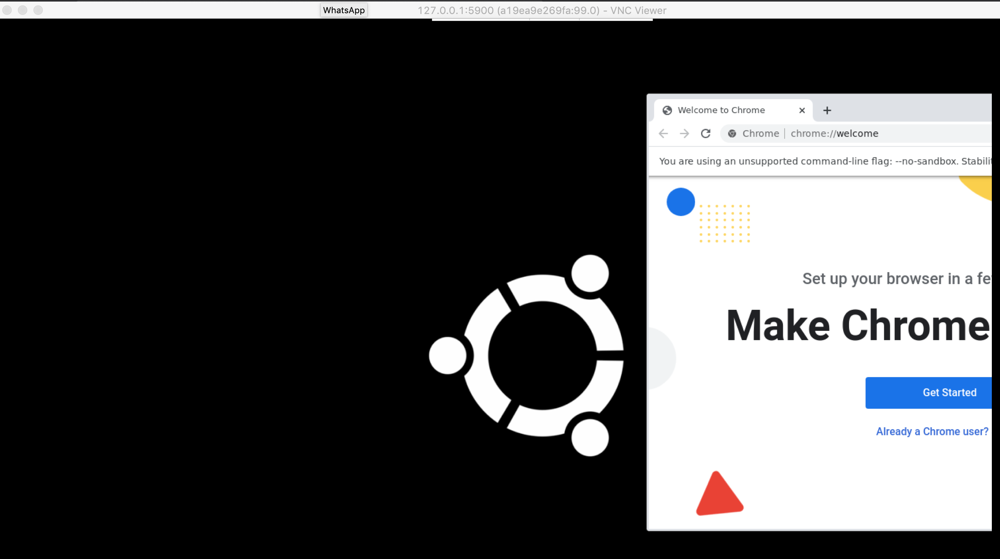

# Docker-Learning
- Some notes I made while learning basic Docker functionality.


## Let's get started
- https://hub.docker.com/
- Download "Docker Desktop for Mac"
- Custom and official Docker IMAGES are on DockerHub, e.g - https://hub.docker.com/_/ubuntu/

## Some core lingo
- Docker IMAGES are used to create CONTAINERS
- A CONTAINER is an instance of an IMAGE
- A CONTAINER is a slimmed down version of an OS
- A DockerFile is basically a type of config file
- VOLUMES allow CONTAINERS to see files from the host machine
- Most docker commands contain an action, a path, and options

## Basic commands
```
docker images = lists all offline images on your machine
docker ps -a = display current running containers
docker ps = display current running containers
docker rmi <imageID> = Deleting an image from your computer
```

## Juicy commands
- **-it** pops us into a container upon creating 
- **bash** commands are set

```
docker run ubuntu = creates an ubuntu container with random name (will download if image is not on machine already)
docker run --name LOL ubuntu = runs an ubuntu container with my custom name "LOL"
docker run -it ubuntu bash = if no --name, a random name will be assigned from docker
```

## Juicier commands
- **-v** mounts a file or drive
- **--rm** deletes a container upon exiting it

```
docker rm $(docker ps -a -f status=exited -q) = delete all local containers
docker run -it --name my-linux-container --rm -v notes.txt ubuntu bash
docker run -it --name my-linux-container --rm -v /c/Users/:/my-data ubuntu bash 
```

## Example 1 - Creating an Ubuntu container from my own image file

This is the basic setup
```
MC-S104581:docker-tutorial dalyw01$ ls
Dockerfile	notes.txt
```

Build an IMAGE from the Dockerfile
- **.** indicates DockerFile is in same directory

```
docker build -t my-ubuntu-image . = build an image from my local Dockerfile
```

Now running the new IMAGE to create a CONTAINER

```
docker run -it my-ubuntu-image bash
```

Verifying Python is actually installed

```
root@29aacfd9b882:/# python3
Python 3.6.9 (default, Nov  7 2019, 10:44:02) 
```

## Example 2 - Creating a nodeJS container, running and viewing on my host machine

Make a directory called my-node-app and go into it

```
MC-S104581:Desktop dalyw01$ mkdir my-node-app
MC-S104581:Desktop dalyw01$ cd my-node-app/
MC-S104581:my-node-app dalyw01$ ls
Dockerfile	index.js	package.json
```

index.js, package.json and DockerFile are located in this repo, copy them into the my-node-app folder

Inside this folder have a file called "Dockerfile" with the following - 

```
    # Dockerfile  
    FROM node:8  
    WORKDIR /app  
    COPY package.json /app  
    RUN npm install  
    COPY . /app  
    EXPOSE 8081  
    CMD node index.js
```

Now create a new IMAGE from it, calling it "wills_node_image"

```
docker build -t wills_node_image .
```

Once you run that command you get should get a lot of output, it ends with something like

```
Step 7/7 : CMD node index.js
 ---> Running in 60b8cefe8344
Removing intermediate container 60b8cefe8344
 ---> 891ddb571099
Successfully built 891ddb571099
Successfully tagged wills_node_image:latest
```

Check the IMAGE has been built successfully

```
MC-S104581:my-node-app dalyw01$ docker images
REPOSITORY          TAG                 IMAGE ID            CREATED             SIZE
wills_node_image    latest              891ddb571099        15 seconds ago      904MB
```

Now you can run it!

```
docker container run -p 4000:8081  wills_node_image
```

Verify it's running

```
MC-S104581:my-node-app dalyw01$ docker ps
CONTAINER ID        IMAGE               COMMAND                  CREATED             STATUS              PORTS                    NAMES
e69acf6e20f6        wills_node_image    "docker-entrypoint.s…"   13 minutes ago      Up 13 minutes       0.0.0.0:4000->8081/tcp   fervent_wing
```

Visit http://localhost:4000/ on your host machines browser, you should see "Hello World!"

However, any changes we make to index.js will not be reflected in our container

So we will kill it

```
docker kill e69acf6e20f6
```

Verify it's been killed successfully

```
MC-S104581:my-node-app dalyw01$ docker ps
CONTAINER ID        IMAGE               COMMAND             CREATED             STATUS              PORTS               NAMES
```

So if you want to make changes to index.js,make the changes then run the following

re-build the image

```
docker build -t wills_node_image .
```

re-run the container

```
docker container run -p 4000:8081  wills_node_image
```

You should see the changes in your browser!




## Commands summarized

```
- - - - - - - - - - - - - - - - - - - -
Listing docker info
- - - - - - - - - - - - - - - - - - - -

docker images
docker ps
docker ps -a 

- - - - - - - - - - - - - - - - - - - -
Creating containers
- - - - - - - - - - - - - - - - - - - -

--name = gives container a name
-it = pops us into a container upon creating 
bash = set bash terminal (use "exit" to leave it)

docker run ubuntu
docker container run ubuntu
docker container run -it ubuntu bash
docker container run ubuntu bash
docker container run --name HAHAHAHAHAHAHAHAH ubuntu

- - - - - - - - - - - - - - - - - - - -
Creating  containers
- - - - - - - - - - - - - - - - - - - -

-v = mounts a file or drive [path to local]:[path inside container]
--rm = deletes a container upon exiting it
-p = specify port or port range

docker container run --name my-linux-container -v notes.txt ubuntu bash
docker container run -it --name my-linux-container --rm -v notes.txt ubuntu bash 
docker container run -it --name water123123 --rm -v /Users/dalyw01/Desktop/docker-tutorial/my-data:/derp-folder ubuntu bash
docker container run -p 4000:8081 wills_node_image

- - - - - - - - - - - - - - - - - - - -
Building custom Images from Dockerfile
- - - - - - - - - - - - - - - - - - - -

-t = names an image
. = is if Dockerfile is in the same directory

docker build -t my-ubuntu-image .
docker build -t wills_node_image .

- - - - - - - - - - - - - - - - - - - -
Destroying images and containers
- - - - - - - - - - - - - - - - - - - -

docker image rm wills_node_image --force
docker kill e69acf6e20f6 = kill a specific container
docker rm $(docker ps -a -f status=exited -q) = delete all local containers
docker rm hopeful_heisenberg = kill a container running in background preventing you starting a new container
```

## Selenium grid

Lets setup our grid first

```
docker run -d -p 4444:4444 --name selenium-hub selenium/hub
```

To check your grid is up and running visit here - http://127.0.0.1:4444

Viewing the entire console here - http://127.0.0.1:4444/grid/console#

Now we'll start running some containers to view in our grid!

Now we want to setup 3 chrome containers on different port numbers

- node-firefox-debug = latest version of firefox
- node-chrome-debug = latest version of chrome
- node-chrome-debug:3.4.0 = older version of chrome v:60.0.3112.113

```
docker run -d -p 5901:5900 --link selenium-hub:hub selenium/node-firefox-debug
docker run -d -p 5902:5900 --link selenium-hub:hub selenium/node-chrome-debug
docker run -d -p 5903:5900 --link selenium-hub:hub selenium/node-chrome-debug:3.4.0
```

When you do a docker ps you should see something like

```
daly:selenium-docker dalyw01$ docker ps
CONTAINER ID        IMAGE                              COMMAND                  CREATED             STATUS              PORTS                    NAMES
835d62d19ff4        selenium/node-chrome-debug:3.4.0   "/opt/bin/entry_poin…"   6 seconds ago       Up 5 seconds        0.0.0.0:5903->5900/tcp   adoring_hopper
da5a4247fc0e        selenium/node-firefox-debug        "/opt/bin/entry_poin…"   13 minutes ago      Up 13 minutes       0.0.0.0:5902->5900/tcp   sweet_gates
2e4b42c6fabf        selenium/node-chrome-debug         "/opt/bin/entry_poin…"   16 minutes ago      Up 16 minutes       0.0.0.0:5901->5900/tcp   reverent_matsumoto
b2a61b36c279        selenium/node-chrome-debug         "/opt/bin/entry_poin…"   16 minutes ago      Up 16 minutes       0.0.0.0:5900->5900/tcp   wizardly_dirac
2c83ced90a54        selenium/hub                       "/opt/bin/entry_poin…"   29 minutes ago      Up 29 minutes       0.0.0.0:4444->4444/tcp   selenium-hub

```

Now download VNC - https://www.realvnc.com/en/connect/download/viewer/

Put this as the URL to connect to the ubuntu container with Chrome - 127.0.0.1:5900

You should be greeted by an Ubuntu desktop

To open Chrome on your Ubuntu image simply

```
Applications > Network > Web Browsing > Google Chrome
```

To open Firefox on your Ubuntu image simply

```
Applications > Shells > Bash
```

Then run

```
firefox -P
```


You should see something like :) - 



To be finished - need to mount drive and get it working!
To be finished - need to have firefox on ubuntu
To be finished - need to have a windows container running
